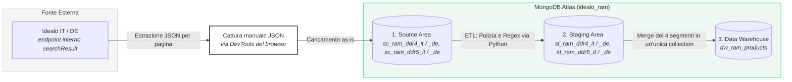
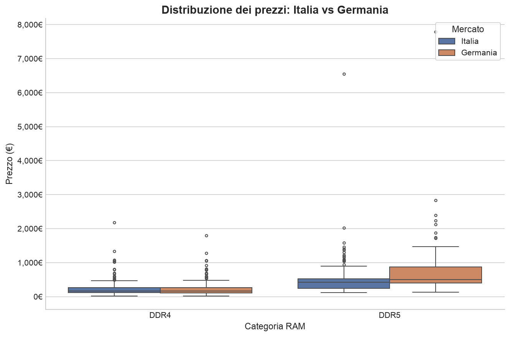
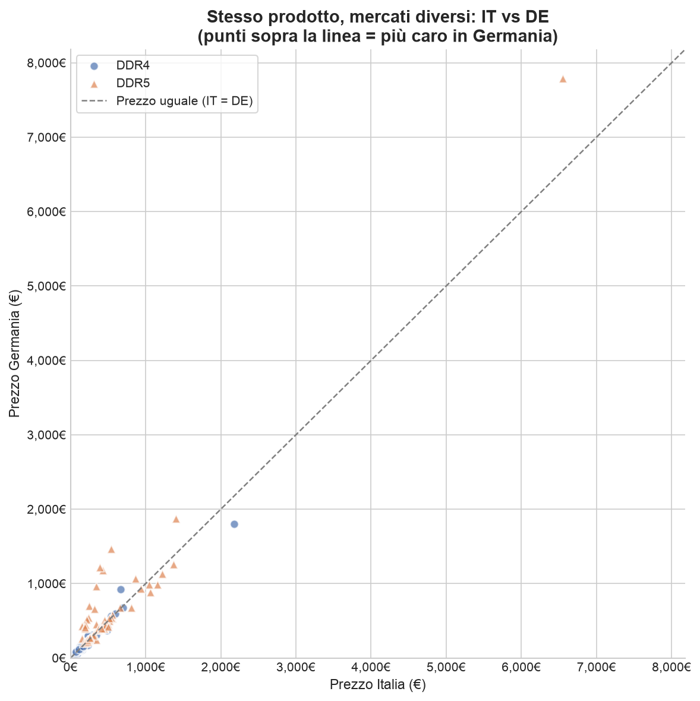
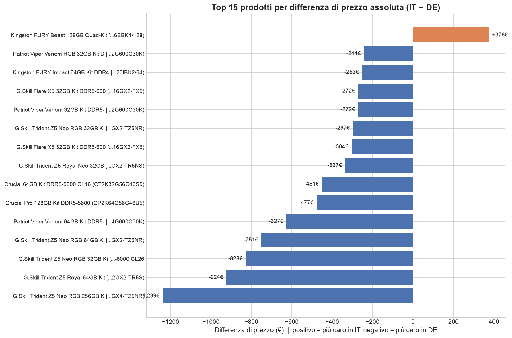

# Idealo RAM Price Analysis — IT vs DE

Pipeline di data engineering e visualizzazione per l'analisi dei prezzi delle memorie RAM (DDR4/DDR5) sui mercati italiano e tedesco, basata su dati Idealo.

## Architettura



- **Source**: dati grezzi catturati dall'API interna di Idealo (`/csr/api/v2/modules/searchResult`) via browser DevTools, essendo lo scraping automatizzato (Selenium, Playwright-stealth, curl_cffi) bloccato da fingerprinting TLS/comportamentale.
- **Staging**: pulizia e normalizzazione per mercato/tipologia (DDR4 IT/DE, DDR5 IT/DE).
- **Data Warehouse**: collezione flat `dw_ram_products` (656 documenti) su MongoDB Atlas.
- **Visualizzazione**: confronto prezzi, distribuzioni e assortimento IT vs DE (matplotlib).

## Struttura del repository

```
├── notebooks/          # Pipeline principale, in ordine di esecuzione
│   ├── 01_load_source.ipynb
│   ├── 02_build_staging.ipynb
│   ├── 03_build_dwh.ipynb
│   ├── 04_export_dwh.ipynb
│   ├── 05_viz_price_comparison.ipynb
│   └── checks/          # Verifica delle evidenze del DWH (conteggi, sample document)
├── data/
│   ├── processed/        # Export finale del DWH (dw_ram_products.csv)
│   └── samples/          # Documenti di esempio ed evidenze (source/DWH)
├── plots/                # Visualizzazioni finali (matplotlib)
├── Report_tecnico.md     # Report tecnico completo del progetto
└── .env.example           # Template variabili d'ambiente
```

## Come eseguire

> **Nota:** i JSON grezzi catturati da Idealo (`data/raw/idealo/`) non sono inclusi in questo repository pubblico per non ridistribuire una copia diretta dei dati della piattaforma. `notebooks/01_load_source.ipynb` richiede quei file per essere rieseguito da zero; il resto della pipeline (staging, DWH, visualizzazioni) può comunque essere ispezionato e il risultato finale è disponibile in `data/processed/dw_ram_products.csv`.

1. Crea un ambiente Python (conda/venv) e installa le dipendenze (`pandas`, `pymongo`, `python-dotenv`, `matplotlib`).
2. Copia `.env.example` in `.env` e inserisci la tua connection string MongoDB Atlas.
3. Esegui i notebook in `notebooks/` nell'ordine numerico (01 → 05).

## Stack tecnologico

Python · Jupyter · pandas · pymongo · MongoDB Atlas (M0 free tier) · matplotlib · python-dotenv

## Risultati

656 prodotti mappati (IT DDR4=174, IT DDR5=152, DE DDR4=174, DE DDR5=156). Analisi comparativa di prezzi, distribuzione e assortimento tra i due mercati — dettagli completi in `Report_tecnico.md`.

<p align="center">
  
  
  
</p>

Altre visualizzazioni (assortimento SKU, capacità/frequenza per mercato, maturità dell'assortimento DDR5) disponibili in `plots/`.
