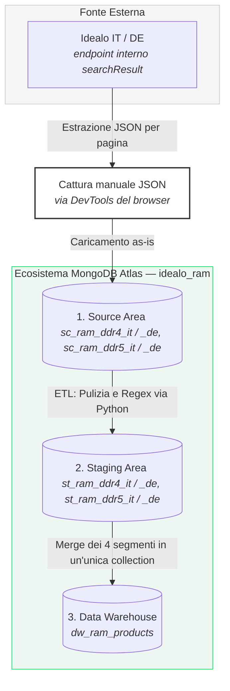

# REPORT TECNICO: HOMEWORK 1
**Master in Business Intelligence & Big Data Analytics — Università degli Studi di Milano-Bicocca**

* **Insegnamento:** Big Data Architecture / BI
* **Studente:** Salvatore Zizzi
* **Titolo del Progetto:** Framework di Procurement Intelligence Transfrontaliero per l'Ottimizzazione della Supply Chain Hardware (Confronto Prezzi RAM IT vs DE)

---

## 1. Scenario, Stakeholder e Utilità (Usefulness)

### Il Contesto di Business
Nel mercato della produzione e dell'assemblaggio di PC (PC Assembly), le memorie RAM rappresentano una *commodity* ad alta volatilità. I prezzi fluttuano quotidianamente a causa di dinamiche geopolitiche, interruzioni della supply chain (es. shortage di semiconduttori, incidenti nei siti produttivi in Asia) e asimmetrie informative tra i mercati europei. 

Le aziende di assemblaggio italiane spesso acquistano dai distributori locali subendo i prezzi del mercato interno, senza sfruttare le finestre di opportunità offerte dai mercati transfrontalieri più liquidi (come quello tedesco).

### Gli Stakeholder
* **Procurement Manager (Responsabile Acquisti):** Ha la necessità di pianificare l'approvvigionamento di stock di RAM (DDR4/DDR5) al prezzo minimo di mercato, massimizzando il margine sul prodotto finito.
* **CFO (Direttore Finanziario):** Vuole minimizzare il rischio di svalutazione del magazzino e proteggere la marginalità aziendale dalle fluttuazioni di prezzo repentine.

### Utilità del Progetto (Usefulness)
Il framework non si limita alla mera comparazione statica dei prezzi per il consumatore finale, ma si configura come uno strumento di supporto al **Procurement**. Permette di ottimizzare i margini operativi tramite arbitraggio geografico, confrontando sistematicamente i prezzi tra i due mercati per segmento (DDR4/DDR5) e configurazione tecnica.

---

## 2. Obiettivi e Domande di Business (Objectives & Questions)

L'obiettivo principale è la realizzazione di una pipeline di data ingestion e modellazione per rispondere ai seguenti quesiti aziendali:

1. **Domanda sull'Arbitraggio Geografico:** Esiste un vantaggio economico sistematico e statisticamente significativo nel rifornirsi sul mercato tedesco (`idealo.de`) rispetto a quello italiano (`idealo.it`)?
2. **Domanda sul Value Engineering:** Quali specifiche combinazioni tecniche (tecnologia DDR, capacità, frequenza MHz) offrono il miglior rapporto *Performance-per-Euro* in un determinato giorno?

---

## 3. Architettura Big Data & Tecnologie Adottate

Per garantire scalabilità, contenimento dei costi (gestione del budget cloud universitario) e flessibilità nel trattamento di dati semi-strutturati, l'architettura adotta il paradigma **Source → Staging → Data Warehouse (Presentation)** implementato attraverso il seguente flusso logico:

* **Infrastruttura di Ingestion:** i tentativi di scraping automatizzato (Selenium, Playwright-stealth, curl_cffi) sono stati bloccati da un sistema di bot-detection avanzato (fingerprinting TLS/comportamentale, riconducibile ad Akamai). La soluzione adottata è stata la cattura manuale delle risposte JSON dell'endpoint interno di Idealo tramite le DevTools del browser (una request salvata per pagina, 5 pagine per combinazione mercato/categoria), poi caricate as-is su MongoDB con uno script Python.
* **Storage e Computazione (NoSQL):** **MongoDB Atlas (Tier M0 gratuito)**, database `idealo_ram`. La scelta del NoSQL documentale è guidata dalla natura semi-strutturata dei dati sorgente (JSON ricchi di oggetti annidati e array flessibili come le caratteristiche tecniche).
* **Motore ETL:** notebook Jupyter/Python che estraggono i dati grezzi, eseguono le trasformazioni in memoria (pandas, regex) e gestiscono i caricamenti bulk verso le collection di staging e la collection finale del DWH.

---

## 4. Caratteristiche del Dataset & Data Profiling

Il framework raccoglie dati relativi a quattro segmenti verticali:
* RAM DDR4 e DDR5 da `idealo.it`
* RAM DDR4 e DDR5 da `idealo.de`

### Struttura del JSON Grezzo (Esempio chiavi rilevate in Source):
* `id` / `hashedProductId`: Identificativi univoci del prodotto.
* `title`: Stringa descrittiva (es. *Corsair Vengeance 32GB Kit DDR5-6400 CL36*).
* `rawPrice`: Valore numerico intero indicante il prezzo minimo di partenza sul mercato.
* `characteristics`: Array di stringhe contenente le specifiche tecniche (`['RAM DDR5', '32 GB', '2 x 16 GB']`).
* `offerInfo`: Sotto-documento con informazioni sulla formattazione del prezzo e valuta.

### Problemi Rilevati nel Data Profiling:
1. **Dati Incompleti (Missing Values):** Alcuni prodotti presentano il campo `characteristics` vuoto o privo di informazioni cruciali come la latenza (CL) o la frequenza in MHz.
2. **Incoerenza di Stringa:** I titoli dei prodotti non seguono una tassonomia standard (es. lo stesso brand viene scritto come "Corsair", "Corsair Memory" o "Corsair Technology").
3. **Duplicati di Sessione:** Se lo scraper viene lanciato più volte nello stesso giorno, rischia di inserire record identici falsando le analisi storiche.

---

## 5. Strategia di ETL & Qualità del Dato (Data Treatment)

I dati attraversano tre livelli di isolamento logico all'interno di MongoDB:

### A. Livello Source (`sc_ram_ddr4_it`, `sc_ram_ddr4_de`, `sc_ram_ddr5_it`, `sc_ram_ddr5_de`)
Raccolta pura delle pagine JSON catturate dall'endpoint di Idealo, un documento per pagina, senza alcuna manipolazione.

### B. Livello Staging (`st_ram_ddr4_it`, `st_ram_ddr4_de`, `st_ram_ddr5_it`, `st_ram_ddr5_de`)
Fase di pulizia e normalizzazione eseguita via Python:
* **Conversione dei Tipi:** Isolamento della chiave `rawPrice` nativa in formato numerico per evitare parsing di stringhe sporche (es. "€ 199,00").
* **Deduplicazione:** i prodotti "figli" (varianti di uno stesso annuncio, collegati al genitore tramite `mainProductId`) vengono scartati solo quando `rawPrice` e `shopName` coincidono esattamente col genitore — circa il 34% dei casi ha invece prezzo o venditore diversi e viene mantenuto come record distinto.
* **Parsing delle Caratteristiche:** Estrazione tramite espressioni regolari (Regex) degli attributi atomici dall'array `characteristics` per popolare campi strutturati: `ram_generation` (DDR4/DDR5), `capacity_gb` (es. 32), `frequency_mts`, `voltage_v`, `cl` (latenza).

### C. Livello Presentation / Data Warehouse (`dw_ram_products`)
Collezione unica e flat (656 documenti) che consolida i quattro segmenti di staging, pronta per l'export e la visualizzazione. Il caricamento è idempotente: ad ogni riesecuzione la collection viene svuotata (`delete_many`) e ripopolata (`insert_many`) per evitare duplicati.

---

## 6. Criticità Emerse e Mitigazione (Critical Issues)

1. **Blocco dei Sistemi Anti-Bot (Aggirato, non risolto via automazione):**
   * *Problema:* La piattaforma target adotta un sistema di bot-detection avanzato (fingerprinting TLS/comportamentale, riconducibile ad Akamai) che ha bloccato tutti i tentativi di scraping automatizzato tentati (`requests`, Selenium, Playwright-stealth, curl_cffi).
   * *Mitigazione:* Rinuncia all'automazione e passaggio alla cattura manuale delle risposte JSON dell'endpoint interno tramite le DevTools del browser, una request per pagina. Soluzione non scalabile ma sufficiente per uno snapshot puntuale dei quattro segmenti di mercato.
2. **Ambiguità nel Sentiment Testuale (Fuori Scope):**
   * *Problema:* Nel mondo hardware, un titolo di borsa o di news come *"Crollo verticale della produzione di memorie Flash"* ha un sentiment testuale negativo, ma per il Procurement Manager è un segnale di "allarme rosso" (futuro innalzamento dei prezzi per scarsità di offerta).
   * *Nota:* La mitigazione (calibrazione del dizionario di Sentiment, VADER o modelli BERT-based, con inversione del sentiment economico) resta teorica: l'acquisizione dei feed di notizie via scraping è bloccata da Akamai, quindi questo modulo non è stato sviluppato e non rientra nel perimetro del progetto.

---

### Stato di Avanzamento del Progetto
* [x] Reverse Engineering dell'endpoint API di Idealo (IT e DE).
* [x] Script di Ingestion automatizzato con paginazione dinamica (`pageIndex`).
* [x] Definizione dello schema NoSQL per i livelli Source, Staging e Presentation.
* [x] Integrazione finale dei livelli e popolamento del Data Warehouse su MongoDB Atlas.
* **Fuori Scope:** Il modulo di scraping/parsing dei feed di notizie per il sentiment sulla supply chain non è stato implementato e non è previsto: i siti target sono protetti da Akamai, che rende lo scraping automatizzato non praticabile con le tecniche disponibili.